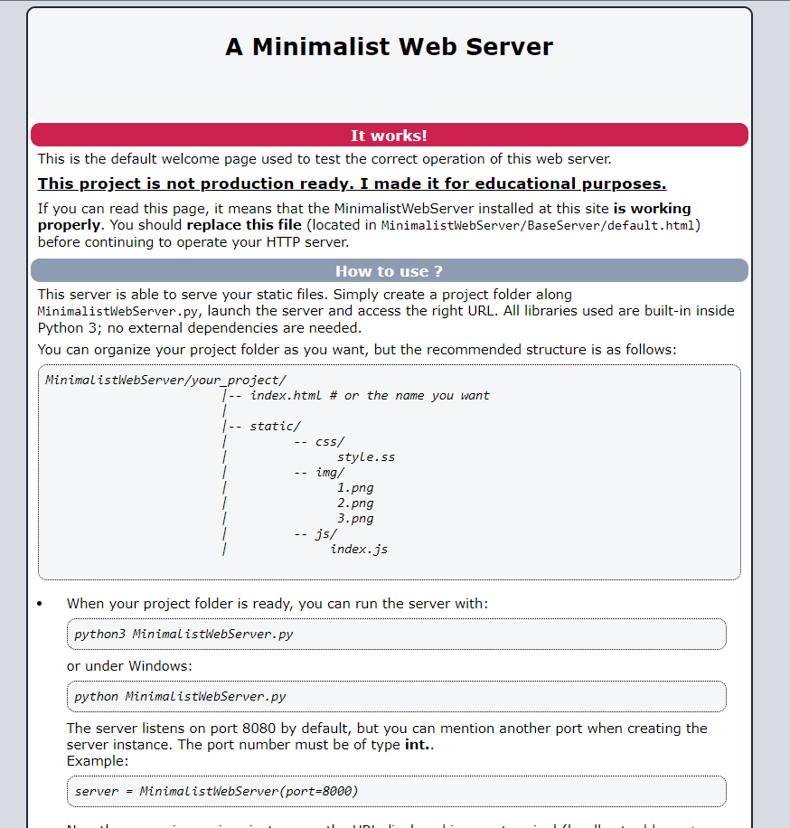
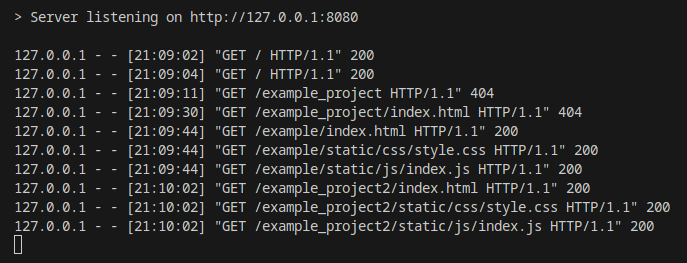

# Minimalist Web Server

This project is a lightweight Python-based web server utilizing the socket module. While simplistic, it offers the functionality to serve static files. It is intended for educational purposes rather than production use.



## Why ?

The goal of creating this web server was to explore how web servers function and gain a better understanding of the HTTP protocol. By constructing a basic server from scratch, the aim was to grasp fundamental concepts such as handling incoming connections, parsing HTTP requests, and serving responses.

This project serves as a stepping stone to comprehend the workings of sophisticated web servers like Apache or Nginx.



## Features

- [x] Serve static files
- [x] Default index file
- [x] Logging
- [x] Error handling
- [x] Documentation
- [x] Unit Testing
- [ ] Multi-threaded
- [ ] HTTPS support


## Usage

_You need python and git installed on your machine to run this program._


First, clone this repository:
```bash
git clone https://github.com/Rayanworkout/MinimalistWebServer
```

```bash
cd MinimalistWebServer
```

Then launch the server:
```bash
python3 minimalist_server.py
```

or under Windows:

```bash
python minimalist_server.py
```
The server listens on localhost:8080 by default, but you can specify another host / port when creating the
server instance or at runtime. The port number must be of type int, and host number of type string.

At runtime:

```bash
python3 minimalist_server.py --port 8000 --host localhost
```

or at server creation, at the end of ```minimalist_server.py```:

```bash
server = MinimalistWebServer(port=8000, host='localhost')
```
Now the server is running, just access the URL displayed in your terminal (host
address + port number).<br>You should see the welcome page, unless you replaced default.html
with your own.


This server is intended to serve static files. To do that, simply create a project folder along
```minimalist_server.py```, launch the server and access the URL.

All libraries used are built-in inside Python 3; no external dependencies are needed.

<p>You can organize your project folder as you want, but the recommended structure is as follows:
</p>
    <pre>
MinimalistWebServer/your_project/
                |-- index.html # or the name you want
                |
                |-- static/
                |         -- css/
                |               style.ss
                |         -- img/
                |               1.png
                |               2.png
                |               3.png
                |         -- js/
                |              index.js
  </pre>

When your project folder is ready, you can acess the URL of your project.

You need to mention your html file in the path, otherwise the server won't find
it. Don't forget to adapt the port number if you changed it.

For example:
```bash
http://127.0.0.1:8080/your_project/index.html
```
That's it, you should be able to see your entry file and all the linked static files will be
served as well.

### Note for Linux users

By default, Linux does not allow access through the web browser to any file apart of those located in <tt>/var/www</tt>, <a href="http://httpd.apache.org/docs/2.4/mod/mod_userdir.html">public_html</a> directories (when enabled) and <tt>/usr/share</tt> (for web applications). If your site is using a web document root located elsewhere you may need to modify your files permissions accordingly.

### Logs

Logs of the server are located in ```BaseServer/logs.log```. The file is created after you run the server for the first time.

### Contributing

Any guidance, suggestions, or collaboration is warmly welcomed and greatly appreciated.
